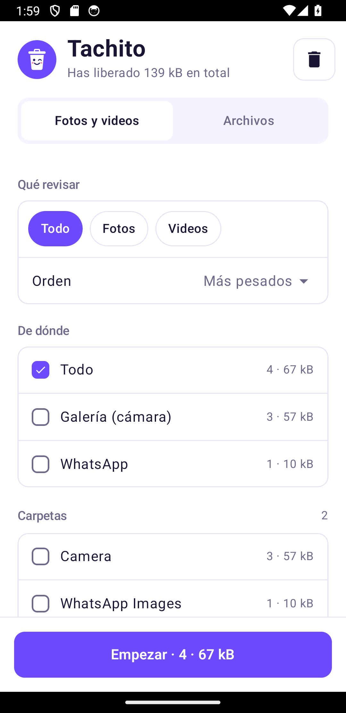
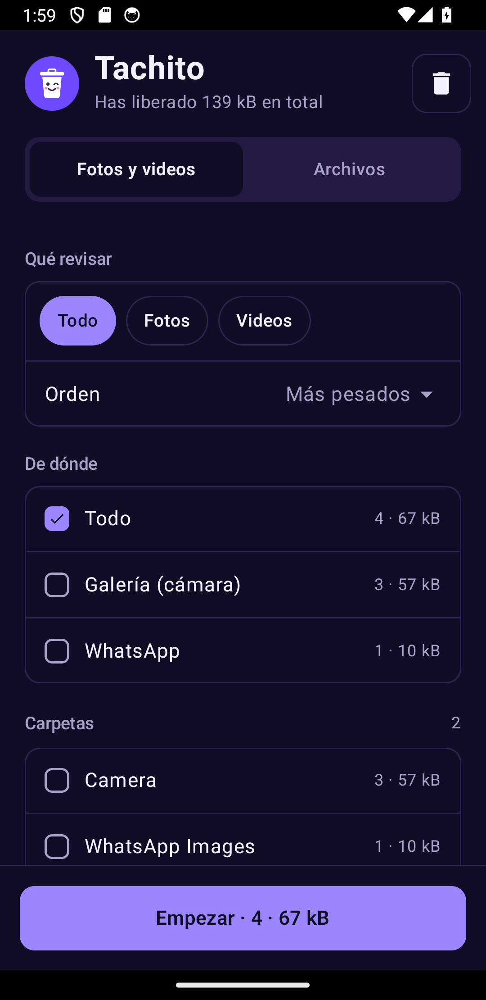
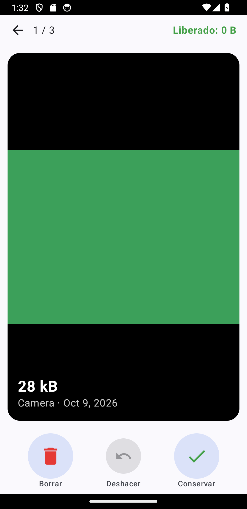

# Tachito

Libera espacio en tu teléfono Android deslizando, al estilo Tinder: **izquierda borra, derecha conserva**. Sin anuncios, sin internet, sin cuentas.

  
  
  

## Estructura

| Carpeta | Contenido |
|---|---|
| [`source/`](source/) | Código fuente de la app (Kotlin + Jetpack Compose). Ver su [README](source/README.md) para compilar. |
| [`docs/`](docs/) | [Instalación para familia y amigos](docs/instalacion.md), [decisiones técnicas](docs/decisiones-tecnicas.md) y capturas. |
| `releases/` | APKs compilados (local, no se sube al repo). |
